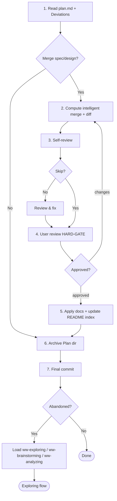

# Archiving

Merge a Plan's `spec.md` / `design.md` into final-state canonical docs — diff-reviewed by the user — then archive the Plan directory and final-commit. Closes out development work and consolidates truth into the updated docs.

## When to use me

Use after `ww-executing` to close out a development Plan: merge its `spec.md` / `design.md` (if any) into canonical docs, archive the Plan, and final-commit. For a bug-fix Plan with no `spec.md` / `design.md`, skip the merge and just archive + commit. Also use to close out an *abandoned* Plan when `ww-executing` hits a fundamental scope error: archive it (no merge — the scope was wrong; the Deviations record why) and final-commit, then hand off to `ww-exploring` (general catch-all) or a more specific research skill (`ww-brainstorming` / `ww-analyzing`) instead of stopping. Do NOT use for documentation work (use `ww-writing-doc`) or when there is no Plan.

## Workflow

Follow these steps in order.

> **Plans that skip the merge (abandoned, or bug-fix with no `spec.md` / `design.md`):** self-review (step 3) and the user-review HARD-GATE (step 4) are skipped — the self-review checklist is entirely merge-focused, so it is N/A here. The final-commit confirmation (step 7) is the gate. This is the one place the "explicit skip answer" pattern does not apply, because there is nothing to review or apply.

### 1. Read plan.md and deviations

Read the Plan's `plan.md` — its `## Doc-change targets` declaration and `## Deviations` — and determine whether this is an abandoned Plan (scope-error close-out from `ww-executing`). The Doc-change targets tell you which of `spec.md` / `design.md` exist and their canonical merge targets. The Deviations record what actually happened vs. the Plan; the merge must be reconciled with the Deviations — the applied docs reflect what actually happened, not stale intentions. If this is an abandoned Plan, or `spec.md` / `design.md` are absent (bug-fix with no doc changes), go straight to step 6 — no merge is performed.

### 2. Compute the intelligent merge and diff

For each declared target (`spec.md` → its canonical doc, `design.md` → its canonical doc, which may be `architecture.md` or a `docs/design/` file): re-read the current target doc at archive time. Compute the intelligent merge:

- If the target is a **new file** (greenfield or new topic): the `spec.md` / `design.md` content becomes the new file.
- If the target **exists**: section-level merge — match headings, add/replace sections so the result reads as final-state (no change markers).

Generate a unified diff of the result against the current docs. If a section can't be reconciled (conflicting content, or anchor drift from a mid-flight trivial direct edit), STOP and ask the user to reconcile.

### 3. Self-review

Ask via `question` whether to skip self-review (`yes` / `no`). If `no`, check against the [Self-review checklist](#self-review-checklist); fix the *merge/diff computation* in place (recompute it), then summarize. The `spec.md` / `design.md` are read-only input here — if they are wrong, STOP and ask the user (or return to `ww-executing` to amend them); do not edit the Plan here.

### 4. User review — HARD-GATE

Present the unified diff for user review. You MUST NOT apply until the user explicitly approves. On requested changes, adjust and re-present. Loop until approval.

### 5. Apply

On approval, apply the merge: write the updated docs (and any new files). Update `docs/README.md`'s index to mirror any newly added doc files. (ADR lifecycle is handled by `ww-writing-doc`; archiving never touches `docs/adr/`.)

### 6. Archive the Plan

Move the Plan directory from `docs/plans/active/` to `docs/plans/completed/` (use `git mv` to preserve history; create `completed/` if absent).

### 7. Final commit

Before committing, verify: merge applied correctly (if any); `docs/README.md` index updated for new files; Plan directory moved via `git mv`. Then stage the doc changes (if any) and the Plan move, propose a message, confirm with the user via `question`, then commit. Never commit without explicit approval. After committing: if this was an abandoned Plan (scope-error close-out from `ww-executing`), load `ww-exploring` (general catch-all) or a more specific research skill (`ww-brainstorming` / `ww-analyzing`) to re-align; otherwise you are done.

## Archiving

Archiving consolidates truth: during execution the Plan was the operative truth and docs lagged; archiving merges `spec.md` / `design.md` so the docs become the live truth again, and files the Plan directory as the change-process record.

### Source of truth

After archiving, the updated docs are the source of truth; the archived Plan directory records the change process (scope, tasks, deviations, doc-change targets). Reconstruct "what changed when" by reading archived Plans under `docs/plans/completed/`.

### Intelligent merge

`spec.md` / `design.md` are free-form final-state markdown written by `ww-planning` (and possibly amended by `ww-executing`). `ww-archiving` merges them into the canonical docs declared in `plan.md`'s `## Doc-change targets`: a new file for a new topic, or a section-level merge into an existing file (match headings, add/replace sections, result reads as final-state). The user reviews the unified diff before application. On an unresolvable section conflict, STOP and ask the user.

### ADR lifecycle

ADRs are created and superseded only by `ww-writing-doc`. `ww-archiving` never touches `docs/adr/`. If execution revealed a decision that should be recorded as an ADR, that belongs to a `ww-writing-doc` invocation (separate from the archive).

## Self-review checklist

- [ ] Diff computed correctly against current docs; result reads as final-state (no change markers).
- [ ] Merge targets match `plan.md`'s `## Doc-change targets` declaration.
- [ ] Drift conflicts (unresolvable sections) surfaced and reconciled with the user, not silently.
- [ ] Applied docs will remain project-pure (no agent / skill / workflow / Plan / process references introduced).
- [ ] `docs/README.md` index updated for any newly added doc files.

## Hard constraints

- Touch only `docs/specs/`, `docs/design/`, `architecture.md`, `docs/README.md` (index), and the Plan directory (`git mv`). No code. No `docs/adr/` (`ww-writing-doc`'s responsibility).
- Applied docs are project artifacts — no references to the agent, skills, workflow, Plans, or process may be introduced into them.
- Never apply the merge before the diff HARD-GATE.
- Never commit without explicit approval — confirm the final-commit message.
