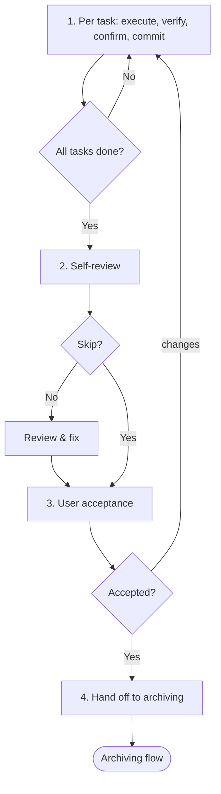

# Executing

Execute a Plan's code tasks in order — verifying and committing each — manage in-flight changes by amending the Plan and logging Deviations in `plan.md`, then hand off to `ww-archiving`.

## When to use me

Use to execute an accepted Plan: carry out its tasks (in `tasks.md`) in order, verify and commit each, manage changes per [Change management](#change-management), then hand off to `ww-archiving` for doc merge and archiving. Do NOT use for documentation writing, planning, or work outside a Plan.

## Workflow



Follow these steps in order.

### 1. Execute the plan

Read `plan.md` (manifest, scope, deviations), `tasks.md` (the tasks), and any `spec.md` / `design.md` (the carried doc changes). Carry out the tasks in order. For each task: execute it, run its verification method (the task is done when verification passes), then propose a commit message and confirm it with the user via `question` before committing that task's changes. Stage any Plan amendments made for that task (Deviations entries appended to `plan.md`, `tasks.md` status notes, and any `spec.md` / `design.md` or scope amendments per [Change management](#change-management)) together with the code in the same commit, so the Plan and code stay in sync per commit.

When a needed change arises, classify and follow [Change management](#change-management) before continuing. Do not silently deviate. Do not proceed to step 2 until every task is done, verified, and committed.

### 2. Self-review

Ask via `question` whether to skip self-review (`yes` / `no`). If `no`, check against the [Self-review checklist](#self-review-checklist), fix issues in place, then summarize changes. Commit any fixes before re-presenting.

### 3. User acceptance — HARD-GATE

Present the completed work for user acceptance: run the full test/lint/build suite (and/or the Plan's verification methods) and show results. You MUST NOT proceed until the user explicitly accepts. On requested changes, make and commit the fixes, then re-present; if changes are substantive, re-run the self-review first. Loop until acceptance.

### 4. Hand off to archiving

Ask via `question` whether to invoke `ww-archiving` next (`yes` / `no`). If `yes`, load it to merge the Plan's `spec.md` / `design.md` and archive the Plan. If `no`, stop.

## Execution

Execution is carrying out an accepted Plan — turning tasks into code. During execution, the Plan (`plan.md` + `tasks.md` + `spec.md` / `design.md`) is the operative truth; docs lag and are merged by `ww-archiving`. Execute faithfully: no scope creep, no silent deviations.

### Source of truth

The Plan governs execution; the design governs shape; the spec governs requirements. If execution reveals the Plan is wrong, amend it per [Change management](#change-management). If it reveals the spec or design is wrong, stop and ask the user — amend the Plan's `spec.md` / `design.md` to reflect the correction (applied at archive); if the issue is fundamental, handle it as a scope error per [Change management](#change-management) — close out the in-flight Plan as abandoned, then return to `ww-exploring` (general catch-all) or a more specific research skill (`ww-brainstorming` / `ww-analyzing`). Never silently override any of them; never leave any stale.

### Per-task verification

- Run each task's verification method as defined in `tasks.md`.
- A task is complete only when its verification passes — then commit it.
- Before user acceptance, run the full test/lint/build suite.
- A failing verification means the task is not done — fix it or stop.

## Change management

During execution, a needed change is handled in place — never silently:

- **Plan-level change.** The change contradicts neither spec nor design (e.g. task reorder, added step, refined `spec.md` / `design.md`). Amend the Plan in place (`tasks.md` and/or `spec.md` / `design.md`) and append a [Deviations](#deviations-log) entry to `plan.md`. No extra gate beyond the per-task commit confirmation.
- **Scope drift (small).** A small shift in scope: amend `plan.md`'s `## Scope` section and append a Deviation entry. Continue.
- **Scope error (fundamental).** The scope itself is wrong. STOP and ask the user via `question`. If the user chooses to revert the committed code, run `git revert` with per-commit confirmation (code is touchable here — `ww-archiving` cannot touch code). Append a Deviation entry to `plan.md` recording the scope error and the user's resolution. Then hand off to `ww-archiving` to close out the in-flight Plan as abandoned (no merge performed — the scope was wrong; the Deviations record why). Only then return to `ww-exploring` (general catch-all) or a more specific research skill (`ww-brainstorming` / `ww-analyzing`) to re-align; carry the archived Plan's path forward so the re-aligned conclusion and new Plan can reference it as superseded.

There is no levelling here: `spec.md` / `design.md` are not merged during execution, so there is no live doc to contradict — every change is a Plan amendment plus a Deviation entry in `plan.md`, except a fundamental scope error, which closes out the Plan as abandoned before returning to a research skill.

### Deviations log

`plan.md` carries a `## Deviations` section (created empty by `ww-planning`). Append one entry per in-flight change, never edit or delete prior entries:

```
- YYYY-MM-DD | Task N | <deviation> | <root cause> | <resolution> | affects: <doc/plan links>
```

## Self-review checklist

- [ ] All Plan tasks (in `tasks.md`) completed, verified, and committed.
- [ ] Full test/lint/build suite passes.
- [ ] No scope creep — only what the Plan specifies was changed.
- [ ] No silent deviations; every in-flight change has a Deviation entry in `plan.md`; scope errors handled by magnitude.
- [ ] `spec.md` / `design.md` and scope amended in the Plan where execution required it.

## Hard constraints

- Execute only the Plan's tasks (in `tasks.md`); no scope creep.
- Touch code and the Plan directory (`plan.md`, `tasks.md`, `spec.md` / `design.md` — amend per change management). Do NOT touch canonical docs (`docs/specs/`, `docs/design/`, `docs/architecture.md`) — the Plan's `spec.md` / `design.md` are merged into them by `ww-archiving`.
- Never commit without explicit user approval — confirm the message before each commit.
- Never skip a gated step. User acceptance is a HARD-GATE; the self-review skip requires an explicit user answer.
